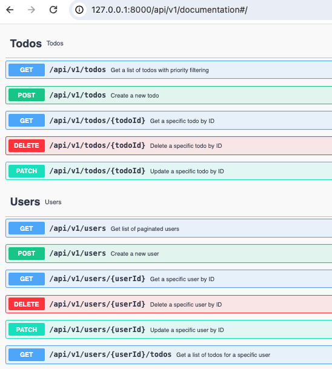

# Laravel Assessment: TODO API

A simple TODO API built using Laravel, following [JSON:API v1.0](https://jsonapi.org/format/1.0/) specification. This project demonstrates creating, reading, updating, and deleting users and TODO items with pagination and filtering.

## Requirements

-   PHP 8.0 or higher
-   Composer
-   MySQL or another compatible database

## Setup

1. Clone the repository:
   - git clone https://github.com/elliekim312/laravel-assessment.git
   - cd laravel-assessment

3. Install dependencies:
   composer install

4. Set up your database in .env file

5. Generate an application key

6. Run database migrations and seeders:
   php artisan migrate --seed

7. Start the development server:
   php artisan serve

8. Access:
   http://127.0.0.1:8000/api/v1/documentation
   :
